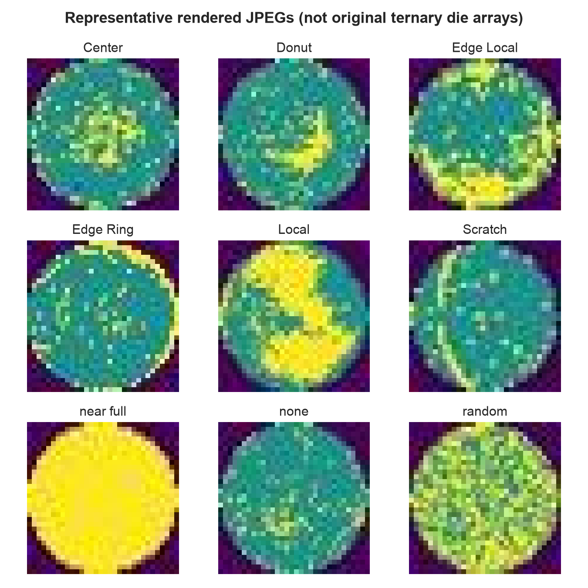

# WPST — Wafer Process Signature Triage

WPST is a locally runnable semiconductor-AI prototype that screens wafer-map
defect patterns, exposes engineer-readable spatial signatures, calibrates model
confidence, and retrieves similar known cases. It is designed as a front end to
process-excursion triage: flagged signatures can be joined with lot/tool/recipe
context and then investigated with process knowledge, designed experiments, or
TCAD.

**Important boundary:** this is not a TCAD simulator and does not infer process
root cause. It classifies spatial patterns in a curated image dataset. Its value
is prioritization and hypothesis support before physics-based investigation.



## Technical snapshot

| Question | Implementation |
|---|---|
| What is the task? | Nine-class wafer-map pattern triage |
| What does the model see? | Cartesian image, polar image, and a 17-value engineer-readable spatial signature |
| How is leakage controlled? | Exact and perceptual groups found within each label folder remain within one partition; a global cross-label duplicate audit is a documented follow-up |
| How is confidence handled? | Validation-only temperature scaling and an adjustable review threshold |
| What supports interpretation? | Spatial descriptors, calibrated class ranking, and similar known cases |
| What is the operational boundary? | Review prioritization and hypothesis support, not causal root-cause diagnosis |

## What is implemented

- Duplicate-aware dataset audit and reproducible train/validation/test manifest
- Interpretable 17-value spatial signature (radial, angular, density, centroid,
  and anisotropy descriptors)
- WPST fusion CNN with Cartesian and polar views plus engineered descriptors
- Class-weighted training, validation-only temperature calibration, and a
  balanced logistic-regression baseline
- Macro-F1, balanced accuracy, per-class precision/recall, confusion matrix,
  and calibration evaluation
- Streamlit workbench with uncertainty routing and similar-case retrieval
- Command-line inference, automated tests, and reproducibility controls

The included seed-42 run achieved **0.812 macro-F1** and **0.812 balanced
accuracy** on the untouched 138-image grouped test split; the engineered-feature
logistic baseline achieved 0.140 macro-F1. These results apply only to this
curated JPEG derivative and exact manifest. See `outputs/metrics.json` and the
technical report for per-class findings and limitations.

This is a single-seed result with 15–16 test examples per class. The baseline is an exploratory engineered-feature comparator, not sufficient evidence that the fusion architecture is superior in general. Multiple-seed confidence intervals, stronger image-only and descriptor-only baselines, and a global cross-label near-duplicate audit remain important follow-up work.

## Repository map

```text
app.py                         Streamlit engineer workbench
config/default.yaml            Reproducible default settings
scripts/download_data.py       Official Kaggle CLI download
scripts/audit_dataset.py       Audit, features, groups, and split manifest
scripts/train.py               Baseline + calibrated WPST training
scripts/evaluate.py            Held-out metrics and plots
scripts/infer.py               Single-image JSON inference
src/wafer_tcad/                Data, features, model, and metric modules
tests/                         Unit and smoke tests
data/processed/                Generated manifest and audit summary
artifacts/                     Generated model checkpoint and baseline
outputs/                       Final DOCX/PDF report deliverables
```

## Prerequisites

- Python 3.10–3.13 recommended (64-bit)
- About 3 GB of free disk space for Python packages, data, and artifacts
- Internet access; a Kaggle account/token is only needed if the public endpoint
  is unavailable in your region
- No GPU is required; the default model is compact and runs on CPU

Python 3.14 may work in the included development environment, but 3.10–3.13 has
broader binary-wheel compatibility. Commands below must be run from this
repository's root folder.

## 1. Create the environment

### macOS (Terminal)

```bash
python3 -m venv .venv
source .venv/bin/activate
python -m pip install --upgrade pip
python -m pip install -r requirements.txt
```

On Apple Silicon, the standard PyPI PyTorch build uses Metal acceleration when
supported, but CPU is sufficient. If `python3` is missing, install a current
Python from https://www.python.org/downloads/ or with Homebrew.

### Windows (PowerShell)

```powershell
py -3.12 -m venv .venv
.\.venv\Scripts\Activate.ps1
python -m pip install --upgrade pip
python -m pip install -r requirements.txt
```

If PowerShell blocks activation, run this once in the same window and retry:

```powershell
Set-ExecutionPolicy -Scope Process -ExecutionPolicy Bypass
```

## 2. Obtain the dataset

The code targets the Kaggle image release documented in
[`DATA_PROVENANCE.md`](DATA_PROVENANCE.md). First try the public official API:

```bash
python scripts/download_data.py
```

If that fails with an authorization error, create a Kaggle API token from
**Kaggle → Settings → API → Create New Token**, then use the placement steps
below and rerun the same command.

### macOS token placement

```bash
mkdir -p ~/.kaggle
mv ~/Downloads/kaggle.json ~/.kaggle/kaggle.json
chmod 600 ~/.kaggle/kaggle.json
python scripts/download_data.py
```

### Windows token placement (PowerShell)

```powershell
New-Item -ItemType Directory -Force "$env:USERPROFILE\.kaggle"
Move-Item "$env:USERPROFILE\Downloads\kaggle.json" "$env:USERPROFILE\.kaggle\kaggle.json"
python scripts/download_data.py
```

If API authentication is unavailable, download the ZIP manually from the
[dataset page](https://www.kaggle.com/datasets/muhammedjunayed/wm811k-silicon-wafer-map-dataset-image),
extract it, and ensure this exact structure exists:

```text
data/raw/WM811k_Dataset/Center/*.jpg
data/raw/WM811k_Dataset/Donut/*.jpg
... one folder per class ...
```

Do not commit `kaggle.json` or redistribute dataset files through this repo.

## 3. Audit and prepare

```bash
python scripts/audit_dataset.py
```

This inspects class counts, image dimensions, exact SHA-256 duplicates, and
perceptual groups; computes spatial descriptors; and creates grouped,
class-stratified splits. Review:

- `data/processed/manifest.summary.json` for the audit
- `data/processed/manifest.csv` for sample-level split/group assignments

The audited local release contains 902 images across nine classes, with every
image measuring 32 × 32 pixels. If your summary differs, treat your copy as a
different dataset state and report its actual output.

## 4. Train

```bash
python scripts/train.py --epochs 12 --seed 42
```

Generated files:

- `artifacts/model.pt` — calibrated WPST checkpoint and training references
- `artifacts/baseline_logistic.joblib` — engineered-feature baseline

For a quick pipeline smoke run, use fewer epochs; do not present that result as
the main experiment:

```bash
python scripts/train.py --epochs 1 --output artifacts/smoke_model.pt
```

## 5. Evaluate

```bash
python scripts/evaluate.py
```

The test split is held out from model selection and temperature fitting. Treat
`outputs/metrics.json` as the source of truth for locally measured performance.
Plots and per-class findings are created by `python scripts/make_figures.py`
under `outputs/figures/`. Do not compare
runs unless their manifests, seeds, code versions, and dataset audits match.

## 6. Launch the demo

```bash
streamlit run app.py
```

Open the local URL printed in the terminal (normally
`http://localhost:8501`). Upload a wafer-map image or choose a curated dataset
example. The workbench shows the calibrated class ranking, a scenario-based
review route, spatial descriptors, and nearest training cases.

The review threshold is an adjustable operational scenario, **not** a cutoff
validated for fab disposition. Low confidence means “ask for review,” not “the
wafer is bad.”

## Command-line inference

The CLI computes the same 17 descriptors automatically. Advanced users may
override them with `--features` in the checkpoint's displayed order.

```bash
python scripts/infer.py path/to/wafer.jpg --checkpoint artifacts/model.pt --top-k 3
```

It prints JSON containing the calibrated prediction, top-three probabilities,
and nearest known training cases when reference embeddings are available.

## Tests

```bash
python -m pytest
```

The suite covers preprocessing, spatial features, polar conversion, model
shape/error behavior, and import-level UI smoke checks.

## Reproducibility and interpretation

- Default random seed: 42; split groups prevent exact/perceptual groups from
  crossing train, validation, and test partitions.
- Class weighting and macro metrics reduce the chance that majority classes
  obscure weak minority-class behavior.
- Temperature scaling is fitted on validation logits only; test labels remain
  unseen until final evaluation.
- Similarity uses learned embeddings and is an inspection aid, not causal
  evidence.
- Folder labels, low image resolution, curated sampling, and missing fab context
  limit external validity. Production use would require fab-owned validation,
  temporal/lot splits, OOD monitoring, traceability, and human governance.

## Troubleshooting

**`Kaggle CLI not found`** — activate the environment and run
`python -m pip install kaggle`.

**`401 Unauthorized`** — regenerate `kaggle.json`, place it in the location
shown above, accept any dataset terms in the browser, and retry.

**Manifest/path error** — confirm `data/raw/WM811k_Dataset` contains the nine
class folders, then rerun the audit from the repository root.

**No checkpoint in the app** — run training first. If you used a custom output,
paste that checkpoint path into the app sidebar.

**PyTorch install fails** — use a supported 64-bit Python version and follow the
[official PyTorch selector](https://pytorch.org/get-started/locally/) for your
OS. Then install the remaining requirements again.

**Streamlit port is busy** — use `streamlit run app.py --server.port 8502`.

## License

Original code and documentation are MIT licensed; see [`LICENSE`](LICENSE).
Dataset and dependency rights remain with their respective owners. See
[`DATA_PROVENANCE.md`](DATA_PROVENANCE.md) before sharing data or artifacts.
